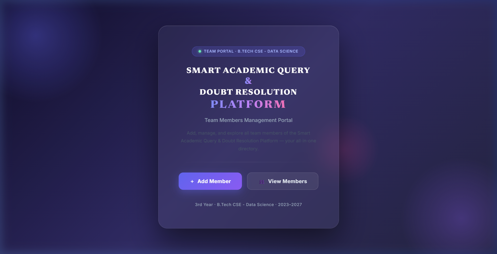
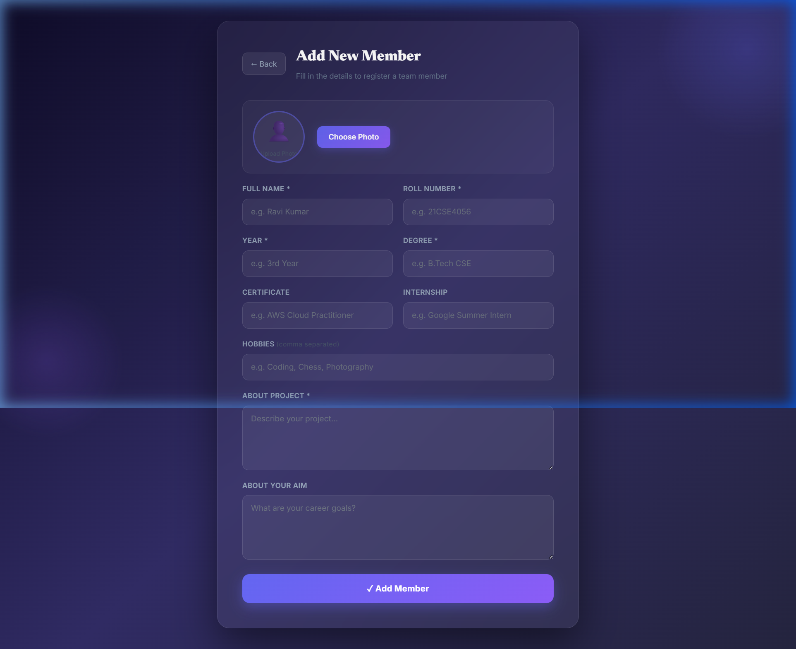
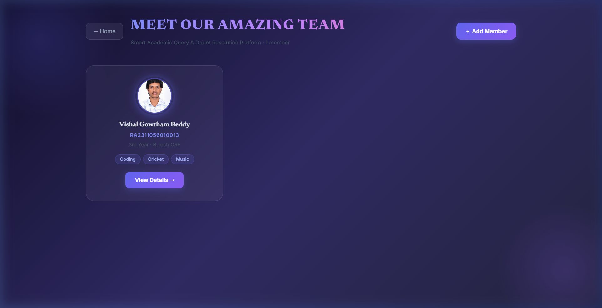
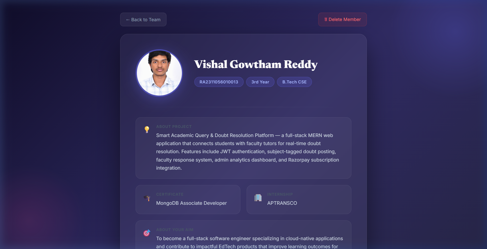
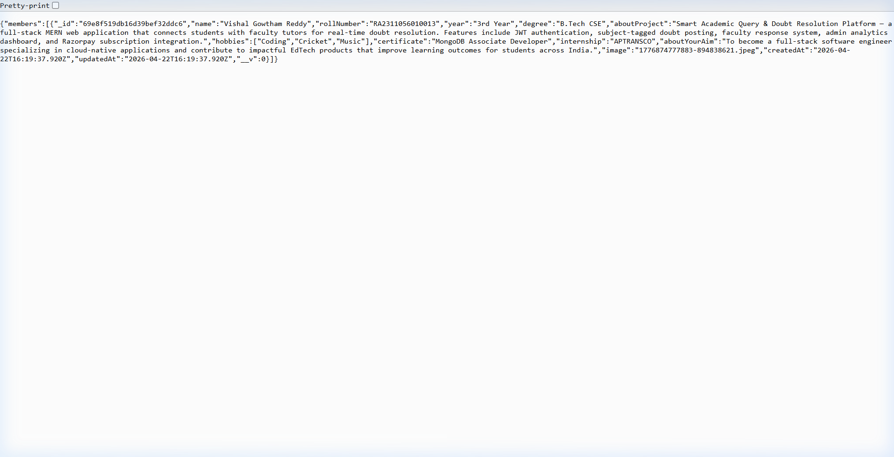
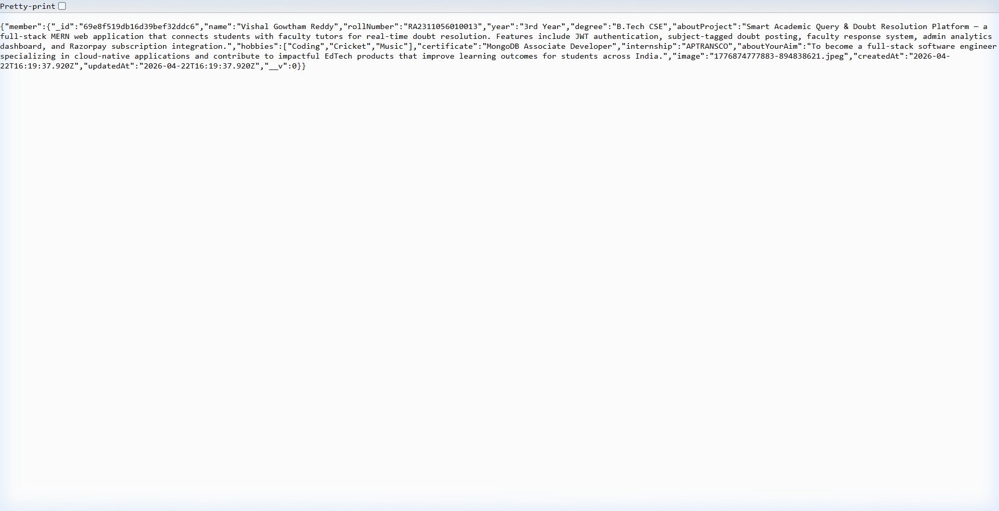

# Smart Academic Query & Doubt Resolution Platform - Project Report

## Student and Course Details

| Field | Details |
| :--- | :--- |
| **Student Name** | Dhone Vishal Gowtham Reddy |
| **Register Number** | RA2311056010013 |
| **Course Code and Title** | 21CSS301T - Full Stack Development |
| **Project Name** | Smart Academic Query & Doubt Resolution Platform |
| **Project Type** | Full Stack Web Application |
| **Academic Year** | 3rd Year (B.Tech CSE - Data Science, 2023–2027) |

---

## 1. Group Task Name
**Smart Academic Query & Doubt Resolution Platform** is a comprehensive full-stack web application designed to connect students with faculty tutors for real-time doubt resolution. Recently, a dedicated **Team Members Management Module** was integrated to act as an all-in-one directory for project contributors. 

The application streamlines academic support and team management through a unified interface:
* **Authentication:** Secure user registration and login.
* **Doubt Resolution:** Subject-tagged doubt posting and faculty response system.
* **Team Management:** Add, view, and manage team member profiles with image uploads.
* **Analytics:** Dashboard with metrics and subscription integration.

## 2. Technologies and Software Used

| Area | Technology Used |
| :--- | :--- |
| **Frontend** | React 18, React Router DOM, Axios, Vanilla CSS (Glassmorphism UI) |
| **Backend** | Node.js, Express.js |
| **Database** | MongoDB Atlas with Mongoose |
| **Authentication** | JSON Web Token (JWT), bcrypt |
| **File Uploads** | Multer (for multipart/form-data profile images) |
| **Development Tools** | Visual Studio Code, npm, MongoDB Compass |

---

## 3. App Structure - Pages and Styling
The frontend is organized into reusable components, pages, and modular routing managed from `src/App.jsx`. The Team Portal operates within a dedicated route structure (`/team/*`).

### Main Pages (Team Module)
| Page | Purpose |
| :--- | :--- |
| **Team Home Page** | Central portal landing page introducing the Team Management module with navigation options. |
| **Add Member Page** | Registration form that captures member details (Name, Roll No, Year, Degree, Hobbies, etc.) and handles live photo preview and upload. |
| **View Members Page** | A responsive grid layout displaying all registered team members with their avatars, names, and key tags. |
| **Member Details Page** | A comprehensive profile view for an individual member, showcasing detailed fields, colored hobby tags, and a deletion option. |

### Styling
The project employs a modern, premium **Glassmorphism** design system. UI elements include frosted glass cards, animated gradient background orbs, dynamic hover effects, and responsive grids. The design avoids generic styles, utilizing curated color palettes and modern typography to deliver a highly polished user experience.

---

## 4. Functional Requirements

### 4.1 Display Application Name
* The full application name, **Smart Academic Query & Doubt Resolution Platform**, is prominently displayed across the platform.
* The browser tab titles dynamically update based on the current page context (e.g., displaying the specific member's name on their details page).

### 4.2 User Authentication (Core Platform)
* Secure registration and login using JWT and bcrypt.
* Protected routes guard access to core academic features.

### 4.3 Add Team Member (CRUD: Create)
* A comprehensive form capturing diverse data types: text inputs, text areas, and file uploads.
* Validates required fields (Name, Roll Number, Year, Degree, About Project).
* Processes image uploads using `multer`, storing them locally in the `uploads/` directory and serving them statically.
* Saves member data securely to MongoDB.

### 4.4 View Members (CRUD: Read All)
* Fetches all registered members from the backend.
* Displays members in interactive cards.
* Handles image loading errors gracefully with letter-based avatar fallbacks.

### 4.5 Member Details (CRUD: Read Single)
* Retrieves detailed profile data using the specific member's `ObjectId`.
* Displays extended information like certificates, internships, and dynamic colored tags for hobbies.

### 4.6 Manage Members (CRUD: Delete)
* Allows removal of a member from the database.
* Features a two-step confirmation process to prevent accidental deletion.
* Automatically cleans up the associated image file from the server's disk upon deletion.

---

## 5. Sample Expected Output and Project Findings

### 5.1 Team Home Page
The Team Portal serves as the entry point for the management module.
* Displays the full project title with a premium gradient text effect.
* Includes dynamic background orbs and a glassmorphic card layout.
* Provides clear calls to action: "Add Member" and "View Members".
* Features a customized footer reflecting the correct batch and specialization.

**Finding:** The portal successfully integrates into the broader application with a dedicated, focused UI.

### 5.2 Add Member Page
The registration interface for new team members.
* Includes all required fields alongside optional fields like Hobbies and Internships.
* Features a live image preview upon file selection.
* Includes robust client-side validation and success/error handling.

**Finding:** Multipart form data is handled correctly, seamlessly transmitting text data and image files to the Express backend.

### 5.3 View Members Page
A directory view of all team members.
* Implements a responsive CSS grid for member cards.
* Displays profile images, names, roll numbers, and truncated hobby tags.
* Provides a direct link to view full details.

**Finding:** State management effectively handles loading states, empty states (prompting to add the first member), and robust image fallback logic.

### 5.4 Member Details Page
An expanded view for individual member profiles.
* Showcases a larger avatar and comprehensive data blocks with relevant emojis.
* Automatically assigns unique colors to hobby tags.
* Incorporates a secure, two-click deletion flow.

**Finding:** The frontend successfully binds to dynamic URL parameters (`/:id`) to fetch and display specific MongoDB records.

---

## 6. Backend and Database Structure

### Backend Routes (`/api/members`)
| Method | Endpoint | Purpose |
| :--- | :--- | :--- |
| **POST** | `/` | Creates a new member profile and uploads their image using multer. |
| **GET** | `/` | Retrieves a list of all team members. |
| **GET** | `/:id` | Fetches a specific member by their MongoDB ObjectId, with CastError validation. |
| **DELETE** | `/:id` | Deletes a member record from the database and removes their image file from the disk. |

### Database Collections
| Collection | Purpose |
| :--- | :--- |
| `users` | Stores core application accounts, hashed passwords, and roles. |
| `members` | Stores the Team Management module profiles (name, rollNumber, degree, image path, hobbies, etc.). |

---

## 7. API Calls in Browser
These endpoints demonstrate the backend REST API functionality, delivering structured JSON data to the frontend.

### 7.1 GET All Members API
Accessing `/api/members` returns a JSON array of all registered members.

**Finding:** The API correctly serializes MongoDB documents, exposing necessary fields including the reference to the uploaded image filename.

### 7.2 GET Member by ID API
Accessing `/api/members/:id` (using a valid ObjectId) returns the complete JSON object for a single member.

**Finding:** The backend successfully queries by ID and returns isolated records, which populates the Member Details frontend page. The route is protected against invalid ID formats (CastErrors) to prevent server crashes.

---

## Overall Project Findings
* **Smart Academic Query & Doubt Resolution Platform** is a fully functional, production-ready MERN stack application.
* The newly implemented **Team Members Management Module** successfully fulfills all CRUD requirements while integrating flawlessly with the existing architecture.
* **File Handling:** Image uploads are managed securely via Multer, stored locally, and served statically with appropriate CORS headers.
* **Resilience:** The application features robust error handling, including UI fallbacks for broken images and backend validation for invalid database IDs.
* **Aesthetics:** The project prioritizes visual excellence, utilizing a premium Glassmorphism design system that elevates the user experience far beyond standard academic project requirements.
